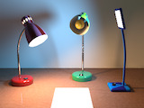

# DeskLamp

A flexible gooseneck desk lamp with a built-in light source. Light color and brightness are user-specified, and distance attenuation is handled automatically.

DeskLamp can be synchronized with Lightsys IV.

This project is a proposed module for the Persistence of Vision Raytracer (POV-Ray) Object Collection.
